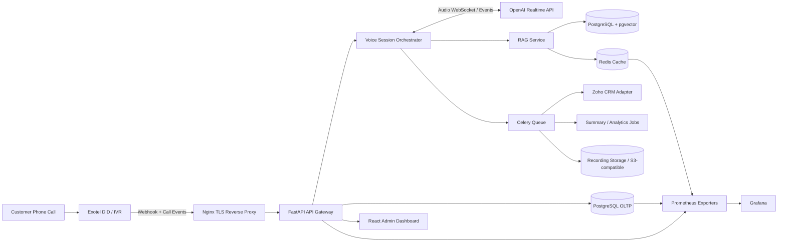
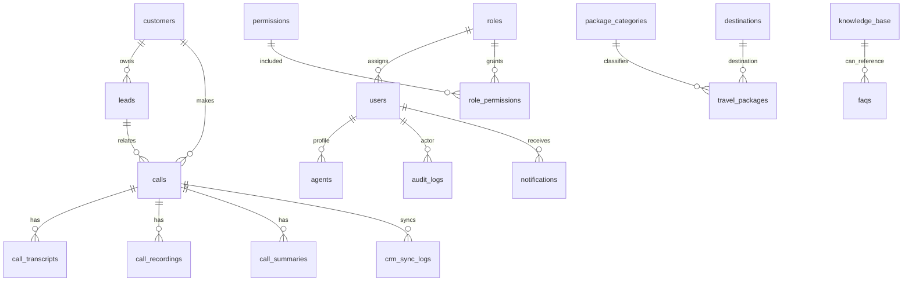

# AI Travel Agency Voice Receptionist — Enterprise Production Design

> Production blueprint for an Indian small-to-medium travel agency SaaS-grade AI voice receptionist supporting English, Hindi, and Marathi. Cost assumptions are estimates as of 2026-06-05 and must be revalidated before procurement.

## 1. Executive Summary

The platform is a production-grade inbound voice receptionist that receives calls through Exotel, streams customer audio to an AI orchestration backend, answers using OpenAI Realtime voice capabilities, retrieves only verified travel knowledge from a RAG layer, qualifies leads, syncs them to Zoho CRM, records transcripts/summaries, and escalates to human agents whenever risk or uncertainty is detected.

Primary production objectives:

- Handle 100 concurrent calls and 10,000 calls/month with horizontal scaling.
- Support dynamic language switching across English, Hindi, and Marathi.
- Never fabricate travel package pricing, availability, visa rules, or office policies.
- Use audited RBAC, JWT auth, refresh-token rotation, input validation, rate limiting, and structured logging.
- Provide admin dashboards for call, lead, conversion, package-interest, transfer, and operational analytics.
- Deploy cost-optimized on India-friendly VPS infrastructure with Docker Compose, Nginx, Prometheus, Grafana, backups, and a zero-downtime path.

Recommended first production topology:

- 2 application VPS nodes in active-active mode.
- 1 database VPS or managed PostgreSQL node with PITR-capable backups.
- Redis HA-ready deployment, initially single primary with append-only persistence and monitored failover runbook.
- Exotel as primary telephony provider and Twilio as optional adapter.
- Zoho CRM as the source of sales-team follow-up, with local CRM sync logs for idempotency and retries.

## 2. High-Level Architecture Diagram



## 3. Detailed System Architecture

### Runtime layers

1. **Telephony ingress**: Exotel receives inbound calls, posts status/webhook events to FastAPI, and uses configured call-flow instructions to bridge audio to the voice gateway where supported. If Exotel account capabilities do not provide direct WebSocket media streaming, use an Exotel App Bazaar/Voice API flow with a lightweight SIP/WebRTC bridge service.
2. **API edge**: Nginx terminates TLS, enforces request-size limits, proxies REST and WebSocket traffic, and exposes health checks for blue-green releases.
3. **FastAPI backend**: Provides REST APIs, webhook handlers, auth, RBAC, dashboard queries, CRUD services, and API adapters.
4. **Voice session orchestrator**: Maintains per-call state, connects to OpenAI Realtime, tracks language/intent/entities, calls tools, and enforces handoff rules.
5. **RAG service**: Retrieves from verified knowledge sources only: FAQs, travel packages, visa rules, seasonal offers, policies, business hours, and contact information.
6. **Data layer**: PostgreSQL stores operational records; pgvector stores embeddings; Redis stores ephemeral call state, rate-limit counters, Celery broker queues, cache entries, and idempotency locks.
7. **Async processing**: Celery workers perform CRM sync, summary generation, post-call enrichment, embeddings, notifications, and backup verification.
8. **Frontend**: React/TypeScript/Tailwind dashboard for admins, owners, consultants, and operations users.
9. **Observability**: JSON logs, PostgreSQL audit logs, Prometheus metrics, Grafana dashboards, and alerting.

### Availability strategy

- Use at least two app nodes behind Nginx or a provider load balancer.
- Keep app containers stateless; store call state in Redis with periodic PostgreSQL checkpoints.
- Run workers as separate scalable containers.
- Use PostgreSQL daily logical backups plus weekly full backups; enable WAL archiving for growth/scale tiers.
- Use rolling or blue-green deployment with health checks and graceful WebSocket drain.

## 4. Service Breakdown

| Service | Responsibility | Scale Driver | Failure Behavior |
|---|---|---:|---|
| `api` | REST APIs, auth, dashboard, webhook endpoints | Requests/sec | Stateless restart; retry webhook idempotently |
| `voice-gateway` | Exotel media bridge, OpenAI Realtime sessions, tool calls | Concurrent calls | Graceful reconnect; transfer if AI unavailable |
| `rag-worker` | Embeddings, semantic search preparation | KB update volume | Retry with dead-letter queue |
| `celery-worker` | CRM sync, summaries, analytics, notifications | Calls/minute | Retries with exponential backoff |
| `celery-beat` | Scheduled backups, cleanup, sync reconciliation | Schedule count | Alert if beat heartbeat missing |
| `postgres` | OLTP, audit logs, pgvector | Storage and query load | Restore from PITR/backup runbook |
| `redis` | Cache, broker, call state, rate limits | Concurrent calls and queue depth | Sentinel/managed HA in growth tier |
| `frontend` | Admin dashboard SPA | Users | CDN or Nginx static fallback |
| `nginx` | TLS, routing, compression, security headers | Connections | Active-active load balancer in growth tier |
| `prometheus` | Metrics collection | Target count | Alert on scrape failures |
| `grafana` | Dashboards | Internal users | Non-critical; backup dashboards |

## 5. Folder Structure

```text
autocall/
  backend/
    app/
      api/v1/endpoints/
      core/
      db/
      models/
      schemas/
      services/
        ai/
        crm/
        rag/
        telephony/
      workers/
      tests/
    alembic/
    Dockerfile
    pyproject.toml
  frontend/
    src/
      app/
      components/
      features/
        auth/
        dashboard/
        leads/
        calls/
        analytics/
        settings/
      hooks/
      lib/
      routes/
      types/
    Dockerfile
    package.json
  database/schema.sql
  deploy/nginx.conf
  scripts/backup_postgres.sh
  docker-compose.yml
  .github/workflows/ci.yml
```

## 6. Database ERD



Important relationship rules:

- Every call may have zero or one lead at the beginning and one lead by the end if qualification succeeds.
- Calls retain immutable transcript and summary history for compliance; updates create new transcript segments, not destructive overwrites.
- `crm_sync_logs` is the idempotency and reconciliation source for Zoho API calls.
- `audit_logs` records all security-sensitive changes and administrative reads.

## 7. PostgreSQL Schema

The complete PostgreSQL schema is checked in at `database/schema.sql`. It includes UUID primary keys, foreign keys, check constraints, indexes, pgvector support, audit fields, and operational enums. Key implementation points:

- Use `pgcrypto` for UUID generation and secure token hashes.
- Use `vector(1536)` for embeddings by default; adjust if the chosen embedding model dimension changes.
- Use JSONB for provider event payloads, extracted entity bags, dashboard metadata, and CRM payload snapshots.
- Use partial indexes on active records and GIN indexes on JSONB/search fields.
- Use read replicas for dashboard analytics in the scale tier.

## 8. Redis Design

Redis key design:

| Key Pattern | Type | TTL | Purpose |
|---|---|---:|---|
| `call:{call_id}:state` | Hash | 2h | Language, intent, entities, sentiment, active tool state |
| `call:{call_id}:turns` | Stream | 24h | Live turn events before durable transcript flush |
| `rate:user:{user_id}` | String counter | 1m | API user rate limit |
| `rate:ip:{ip}` | String counter | 1m | Anonymous/webhook rate limit |
| `idem:{provider}:{event_id}` | String | 24h | Telephony/CRM idempotency |
| `kb:search:{hash}` | JSON | 15m | RAG search result cache |
| `agent:presence:{agent_id}` | Hash | 5m | Human agent availability |
| `celery` queues | List/Stream | N/A | Broker queues |

Operational settings:

- Enable AOF persistence for broker durability.
- Use separate logical Redis databases or separate clusters for broker and cache in growth tier.
- Alert when memory exceeds 75%, evicted keys > 0, queue lag > 60 seconds, or Redis round-trip latency > 25 ms.

## 9. API Specifications

### API principles

- Base path: `/api/v1`.
- Authenticated APIs require `Authorization: Bearer <access_token>`.
- Webhook APIs require provider signature verification and idempotency keys.
- All list APIs support pagination: `page`, `page_size`, `sort`, `filter`.
- Validation uses Pydantic models; database writes use SQLAlchemy ORM or SQLAlchemy Core parameter binding.
- Error shape:

```json
{
  "error": {
    "code": "VALIDATION_ERROR",
    "message": "Human readable message",
    "details": {},
    "request_id": "req_..."
  }
}
```

### Authentication APIs

| Method | Path | Request | Response | Notes |
|---|---|---|---|---|
| POST | `/auth/login` | email, password | access_token, refresh_token, user | Password hash verified with Argon2id/bcrypt |
| POST | `/auth/refresh` | refresh_token | rotated tokens | Reuse detection revokes session family |
| POST | `/auth/logout` | refresh_token | status | Revokes current token |
| POST | `/auth/password/forgot` | email | status | Rate limited |
| POST | `/auth/password/reset` | token, new_password | status | Token hash stored only |

### Lead APIs

| Method | Path | Description |
|---|---|---|
| GET | `/leads` | Search leads by status, destination, travel date, owner, source |
| POST | `/leads` | Create lead manually |
| GET | `/leads/{lead_id}` | Fetch lead with calls and CRM status |
| PATCH | `/leads/{lead_id}` | Update qualification fields |
| POST | `/leads/{lead_id}/assign` | Assign to agent |
| POST | `/leads/{lead_id}/sync/zoho` | Force CRM sync retry |

Lead request model highlights:

- `phone_number`: E.164 normalized Indian mobile/landline supported.
- `email`: RFC-compliant email if provided.
- `budget`: positive decimal in INR.
- `travel_date` and `return_date`: return date must be after travel date.

### Call APIs

| Method | Path | Description |
|---|---|---|
| POST | `/telephony/exotel/inbound` | Exotel inbound webhook |
| POST | `/telephony/exotel/status` | Exotel status/recording webhook |
| GET | `/calls` | List calls with filters |
| GET | `/calls/{call_id}` | Call detail with transcript, summary, recording metadata |
| GET | `/calls/{call_id}/transcript` | Paginated transcript segments |
| POST | `/calls/{call_id}/transfer` | Manual transfer to agent |
| POST | `/calls/{call_id}/summary/regenerate` | Re-run summary job |

### Dashboard and analytics APIs

| Method | Path | Description |
|---|---|---|
| GET | `/dashboard/overview` | Total calls, leads, conversions, missed calls, active agents |
| GET | `/analytics/calls` | Call duration, status, language, transfer stats |
| GET | `/analytics/leads` | Funnel by status and source |
| GET | `/analytics/packages` | Package interest trends and top destinations |
| GET | `/analytics/quality` | AI confidence, fallback attempts, escalation reasons |

### CRM APIs

| Method | Path | Description |
|---|---|---|
| GET | `/crm/zoho/status` | OAuth/token and sync health |
| POST | `/crm/zoho/connect` | Store OAuth connection metadata |
| GET | `/crm/sync-logs` | List sync attempts and failures |
| POST | `/crm/sync-logs/{id}/retry` | Retry failed operation |

### Knowledge Base APIs

| Method | Path | Description |
|---|---|---|
| GET | `/knowledge` | List KB articles |
| POST | `/knowledge` | Create article and enqueue embedding |
| PATCH | `/knowledge/{id}` | Update article, version, and re-embed |
| POST | `/knowledge/{id}/publish` | Publish approved content |
| POST | `/knowledge/search` | Semantic plus fallback search |

### Package, user, settings APIs

- `/packages`, `/packages/{id}`, `/destinations`, `/package-categories` for package management.
- `/users`, `/roles`, `/permissions`, `/agents` for RBAC and staff management.
- `/settings/system`, `/settings/telephony`, `/settings/ai`, `/settings/security` for operational configuration.

## 10. AI Agent Architecture

### Agent pipeline

1. **Session start**: Create call row, initialize Redis state, load agency settings, language defaults, transfer numbers, and active offers.
2. **Greeting**: Disclose AI receptionist identity and ask how it can help.
3. **Language detection**: Detect English/Hindi/Marathi per utterance and continue in the caller's language; allow code-switching.
4. **Intent classification**: Classify one or more intents from the required taxonomy.
5. **Entity extraction**: Extract name, phone, email, destination, departure city, travel dates, traveler counts, budget, hotel category, and travel type.
6. **RAG retrieval**: Query verified sources before answering factual questions.
7. **Tool execution**: Search package inventory, create/update lead, check business hours, create CRM sync job, or transfer.
8. **Policy guardrails**: Block fabricated prices, availability, visa outcomes, refund decisions, or guarantees.
9. **Conversation repair**: If confidence is low, ask clarifying questions. After two failed attempts, transfer.
10. **Call close**: Confirm collected data, summarize next steps, enqueue CRM sync and post-call summary.

### Required intents

- Tour Package Inquiry
- Flight Inquiry
- Hotel Inquiry
- Visa Inquiry
- Passport Inquiry
- Travel Insurance Inquiry
- Group Booking
- Honeymoon Package
- Family Package
- Corporate Travel
- Existing Booking Support
- Refund Inquiry
- Complaint
- Human Agent Request
- Office Information
- Pricing Inquiry

### Tool contract examples

```json
{
  "name": "search_travel_packages",
  "arguments": {
    "destination": "Dubai",
    "departure_city": "Mumbai",
    "travel_date": "2026-11-10",
    "travelers": 4,
    "budget_inr": 250000
  }
}
```

```json
{
  "name": "create_or_update_lead",
  "arguments": {
    "customer_name": "Amit Patil",
    "phone_number": "+9198XXXXXXXX",
    "language": "mr-IN",
    "intent": "Family Package",
    "entities": {
      "destination": "Kerala",
      "adults": 2,
      "children": 2
    }
  }
}
```

### Voice prompt guardrails

- Always say prices and availability are based only on current agency records.
- If the package is not found, offer to have a consultant call back rather than inventing options.
- For visa/passport advice, provide general process information and route complex eligibility questions to a human.
- If anger, complaint, refund, urgency, VIP tag, or explicit agent request is detected, transfer with context.

## 11. RAG Architecture

### Knowledge sources

- FAQs.
- Travel packages.
- Visa rules.
- Seasonal offers.
- Company policies.
- Business hours.
- Contact information.

### Indexing pipeline

1. Content author creates/updates a KB article, FAQ, package, or policy.
2. Reviewer approves content for publication.
3. Celery embedding job chunks content by semantic sections with language metadata.
4. Embeddings are generated and stored in PostgreSQL `knowledge_base.embedding` using pgvector.
5. A keyword `tsvector` index is updated for fallback search.
6. Cache invalidation removes stale Redis search keys.

### Retrieval pipeline

1. Normalize query and detect language.
2. Search vector index with metadata filters: `published`, `content_type`, destination, category, and language.
3. Run fallback keyword search if vector results are weak.
4. Re-rank using relevance, freshness, and source authority.
5. Return short grounded snippets and source IDs to the AI agent.
6. Require the answer to cite internal source IDs in call metadata for audit, even if callers do not hear citations.

### Anti-hallucination controls

- The AI can answer package pricing only from active `travel_packages` rows.
- The AI can answer policies only from published KB/policy records.
- The AI must answer “I’ll connect you with a consultant” when retrieval confidence is below threshold.
- Visa and refund answers are informational unless an authorized human or configured policy confirms the decision.

## 12. CRM Integration Design

Zoho CRM integration uses OAuth, background synchronization, and idempotent operation logs.

### Objects created

- **Lead**: For new package/flight/hotel/visa/passport/insurance inquiries.
- **Contact**: For known customers or converted leads.
- **Activity Log**: For call interaction and next follow-up task.
- **Call Summary**: Notes attached to the lead/contact with intent, language, entities, sentiment, and recording URL.

### Sync workflow

1. `create_or_update_lead` creates local lead immediately.
2. Celery job creates `crm_sync_logs` row with idempotency key.
3. Zoho adapter maps local fields to Zoho modules.
4. Retry transient failures with exponential backoff.
5. Permanent failures are visible in dashboard and alert operations.
6. Nightly reconciliation compares recent local leads with Zoho IDs.

### Field mapping

| Local Field | Zoho Field |
|---|---|
| `leads.customer_id` | Lead/Contact phone match |
| `leads.intent` | Lead Source / Product Interest |
| `leads.destination` | Destination |
| `leads.budget` | Budget |
| `calls.summary` | Notes / Call Description |
| `calls.recording_url` | Call Recording Link |
| `leads.next_follow_up_at` | Task Due Date |

## 13. Exotel Integration Design

### Inbound call flow

1. Customer calls Exotel virtual number.
2. Exotel invokes `/api/v1/telephony/exotel/inbound` with call SID, caller number, called number, timestamp, and signature.
3. Backend validates signature, normalizes caller phone, and creates a call session.
4. Backend responds with Exotel-compatible instructions to connect audio to the voice gateway or SIP bridge.
5. Voice gateway streams bidirectional audio to OpenAI Realtime.
6. Status/recording webhooks update call state and recording metadata.
7. On handoff, backend instructs Exotel to transfer to available agent number and passes context via dashboard/notification.

### Webhook security

- Verify Exotel signature/token on every webhook.
- Use IP allowlisting where Exotel publishes stable ranges or a VPN/private integration is available.
- Enforce idempotency using provider event IDs.
- Reject stale webhook timestamps outside a five-minute window.
- Log raw event metadata in JSONB but redact sensitive values in application logs.

### Twilio adapter

Use a common `TelephonyProvider` interface:

- `parse_inbound_event`.
- `build_answer_response`.
- `connect_media_stream`.
- `transfer_call`.
- `fetch_recording_metadata`.
- `verify_signature`.

## 14. Security Architecture

### Authentication and authorization

- JWT access tokens with 10-15 minute lifetime.
- Refresh tokens with rotation, token-family tracking, hashing at rest, and reuse detection.
- RBAC through `roles`, `permissions`, and `role_permissions`.
- Fine-grained permissions: leads read/write, calls read, recordings read, settings write, users manage, CRM retry, KB publish.

### Application security

- Password hashing with Argon2id preferred; bcrypt acceptable if tuned.
- Pydantic validation for all request models.
- SQLAlchemy parameterization; no raw string interpolation for SQL.
- Rate limiting per user, IP, and webhook source.
- XSS prevention through output encoding in React, strict CSP, and sanitized HTML rendering for KB content.
- CSRF protection if refresh tokens are stored in cookies; otherwise store refresh token securely and rotate.
- CORS allowlist for dashboard domains only.
- Security headers: HSTS, CSP, X-Content-Type-Options, X-Frame-Options, Referrer-Policy.

### Data protection

- Encrypt secrets in `.env` storage or external secret manager.
- Rotate OpenAI, Exotel, Zoho, JWT, and database credentials quarterly or after suspected exposure.
- Store only recording metadata locally unless business requires local media storage.
- Mask phone/email in logs.
- Keep audit logs immutable for at least 180 days.
- Define retention: transcripts 365 days by default, recordings 180 days by default, configurable by agency policy.

### Audit logging

Audit these events:

- Login/logout/refresh-token anomalies.
- User, role, permission changes.
- Settings and secret reference changes.
- KB publish/unpublish.
- Lead export/read of sensitive customer data.
- Recording/transcript access.
- CRM manual retry or override.

## 15. React Frontend Architecture

### Pages

- `/login` and `/forgot-password`.
- `/dashboard` overview cards and charts.
- `/leads` list, filters, kanban/funnel, lead detail.
- `/calls` call history, transcript, recording, summary, handoff reason.
- `/analytics` call trends, package trends, top destinations, conversion funnel.
- `/knowledge` KB article management and publish workflow.
- `/packages` travel package, destination, and category management.
- `/agents` human agent presence and assignment.
- `/settings` organization, telephony, AI, CRM, security settings.

### Component structure

- `components/ui`: Button, Card, Input, Select, Modal, Table, Badge.
- `components/charts`: LineChart, BarChart, FunnelChart, DonutChart.
- `features/auth`: auth store, login form, route guards.
- `features/calls`: transcript viewer, recording player, call summary panel.
- `features/leads`: lead form, lead detail, CRM sync badge.
- `features/knowledge`: article editor, source metadata, publish controls.

### Frontend security

- Store access token in memory where possible; use secure refresh strategy.
- Route guards check permissions from `/auth/me`.
- Redact phone/email unless user has sensitive-data permission.
- Avoid rendering unsanitized KB HTML.

## 16. Backend FastAPI Architecture

### Backend modules

- `core/config.py`: Pydantic settings and secret references.
- `core/security.py`: JWT, password hashing, RBAC dependencies.
- `core/rate_limit.py`: Redis-backed rate limiter.
- `db/session.py`: SQLAlchemy async session factory.
- `models/`: SQLAlchemy ORM models aligned to `database/schema.sql`.
- `schemas/`: Pydantic request/response models.
- `api/v1/endpoints/`: REST routers.
- `services/telephony/`: Exotel/Twilio adapters.
- `services/ai/`: Realtime client, prompt templates, tool registry.
- `services/rag/`: chunking, embeddings, retrieval, reranking.
- `services/crm/`: Zoho OAuth and module mapping.
- `workers/`: Celery tasks and scheduled jobs.

### Concurrency design

- Use async FastAPI for webhook and dashboard APIs.
- Run voice sessions in dedicated workers/processes to isolate long-lived WebSocket calls.
- Set container limits based on measured sessions per worker; initial sizing target is 20-30 concurrent sessions per voice container.
- Use graceful shutdown hooks to stop accepting new calls and transfer or drain active sessions before deployment.

## 17. Docker Configuration

Production support files are included in this repository:

- `docker-compose.yml` defines API, worker, beat, frontend, PostgreSQL, Redis, Nginx, Prometheus, and Grafana service wiring.
- `deploy/nginx.conf` defines TLS-ready reverse proxy behavior, security headers, REST routing, and WebSocket routing.
- `scripts/backup_postgres.sh` creates compressed daily PostgreSQL backups and prunes old backups.

Recommended production changes before launch:

- Replace local PostgreSQL/Redis containers with managed or separately hardened VPS services for growth tier.
- Use a real S3-compatible object store for recordings and backups.
- Mount secrets through environment injection or a secret manager, not committed files.
- Configure Nginx with real TLS certificates from Let’s Encrypt.

## 18. CI/CD Pipeline

The checked-in GitHub Actions workflow (`.github/workflows/ci.yml`) runs backend lint/test placeholders, frontend lint/build placeholders, Docker Compose config validation, and SQL schema validation smoke checks.

Production pipeline stages:

1. Pull request validation: lint, unit tests, API tests, schema checks, frontend build.
2. Security checks: dependency scan, secret scan, container scan.
3. Build immutable Docker images tagged by commit SHA.
4. Push to registry.
5. Deploy to staging.
6. Run smoke tests against staging.
7. Blue-green production deploy.
8. Health-check and metrics validation.
9. Rollback if error budget or health checks fail.

## 19. Monitoring Architecture

### Metrics

- API latency, error rate, request count by route.
- Webhook validation failures and idempotent duplicates.
- Active calls, call setup latency, AI latency, transfer count.
- Intent distribution, language distribution, confidence distribution.
- RAG retrieval latency and no-result rate.
- OpenAI token/audio usage and estimated cost.
- Exotel call minutes and failed transfers.
- Zoho sync success/failure/retry counts.
- PostgreSQL connections, slow queries, deadlocks, replication lag.
- Redis memory, latency, queue depth, evictions.

### Alerts

- Active calls near capacity: >80 concurrent for 10 minutes.
- AI session failure rate >5% over 5 minutes.
- Webhook 5xx >2% over 5 minutes.
- CRM sync backlog >100 jobs or oldest job >30 minutes.
- PostgreSQL disk >80%, Redis memory >75%.
- Backup missing or restore verification failed.

## 20. Testing Strategy

### Unit tests

- Intent classifier contract tests.
- Entity extraction validation.
- Handoff rule evaluator.
- RBAC permission checks.
- JWT refresh rotation and reuse detection.
- Telephony signature verification.
- Zoho field mapping.
- RAG chunking and search filters.

### Integration tests

- Exotel inbound webhook to call creation.
- Call transcript ingestion to summary job.
- Lead creation to Zoho sync log.
- KB publish to embedding job.
- Auth flows with role restrictions.

### API tests

- Positive and negative tests for every REST endpoint.
- Validation boundary tests for phone, dates, travelers, budget, and email.
- Rate-limit and idempotency tests.

### Load testing plan

- Use k6/Locust for REST APIs and a separate SIP/media simulator for call load.
- Validate 100 concurrent calls, 95th percentile API latency under 300 ms for dashboard APIs, and no more than 2 seconds AI first-response latency after call connection under normal load.
- Run soak test for 8 hours with realistic call lengths and CRM retry load.

### Security testing plan

- OWASP ZAP baseline scan against staging.
- Dependency scans for Python and Node packages.
- Secret scanning in CI.
- JWT tampering and refresh-token replay tests.
- Webhook signature bypass tests.
- RBAC horizontal/vertical access-control tests.
- Audit-log completeness tests.

Target: 80%+ backend unit/integration coverage and critical-path frontend component coverage.

## 21. Cost Analysis (INR)

Sources used for estimate assumptions:

- OpenAI pricing page observed GPT-Realtime-2 audio input/output and streaming speech-to-text rates.
- DigitalOcean pricing page observed India/Bangalore availability, Droplet prices, bandwidth, and daily backup percentage.
- Zoho CRM pricing page observed INR user/month rates for Standard, Professional, Enterprise, and Ultimate.
- Exotel pricing is often plan/custom-credit based; validate exact committed rates with Exotel sales before launch.

Currency assumption: USD 1 = INR 84 for planning only.

### Usage assumptions

| Plan | Calls/month | Avg duration | AI minutes | Concurrent target |
|---|---:|---:|---:|---:|
| Startup | 2,000 | 3 min | 6,000 | 20 |
| Growth | 10,000 | 4 min | 40,000 | 100 |
| Scale | 50,000 | 5 min | 250,000 | 300+ |

### Estimated monthly costs

| Cost Item | Startup | Growth | Scale |
|---|---:|---:|---:|
| VPS/app/database/monitoring | ₹8,000-₹18,000 | ₹35,000-₹75,000 | ₹1,50,000-₹4,00,000 |
| Backups/object storage | ₹1,000-₹4,000 | ₹5,000-₹20,000 | ₹50,000+ |
| Exotel telephony | ₹5,000-₹25,000 | ₹25,000-₹1,25,000 | Custom enterprise |
| OpenAI voice and summaries | ₹35,000-₹1,20,000 | ₹2,50,000-₹8,00,000 | ₹15,00,000+ |
| Zoho CRM | ₹0-₹7,000 | ₹8,000-₹30,000 | ₹50,000+ |
| Monitoring/security tools | ₹0-₹5,000 | ₹5,000-₹25,000 | ₹50,000+ |
| **Estimated total** | **₹49,000-₹1,69,000** | **₹3,28,000-₹10,75,000** | **₹17,50,000+** |

### Cost optimization actions

- Use Realtime only during live voice turns; close idle sessions quickly.
- Cache system prompts and stable KB context where supported.
- Use smaller/cheaper text models for post-call summaries when latency is not critical.
- Compress and lifecycle recordings to low-cost object storage.
- Route simple office-hours calls through deterministic IVR or FAQ flows where acceptable.
- Monitor cost per qualified lead, not only cost per minute.

## 22. Scalability Roadmap

### Startup stage

- Single app VPS plus database VPS.
- Docker Compose deployment.
- Redis single node with persistence.
- Manual backup verification weekly.

### Growth stage

- Two or more app nodes behind load balancer.
- Dedicated voice-gateway replicas.
- Managed or dedicated PostgreSQL with read replica.
- Redis Sentinel or managed Redis.
- Object storage for recordings/backups.
- Blue-green deployments.

### Scale stage

- Kubernetes or Nomad if operational maturity justifies it.
- Dedicated media/SIP bridge layer.
- Sharded voice session workers by telephony provider/region.
- PostgreSQL partitioning for calls/transcripts/audit logs.
- Multi-region DR for dashboard/API and warm standby database.

## 23. Production Deployment Guide

### Pre-launch checklist

1. Buy Exotel number and configure inbound call app.
2. Configure Zoho OAuth app and CRM field mapping.
3. Create OpenAI API key with least privilege and budget alerts.
4. Provision VPS instances in India or nearest low-latency region.
5. Configure DNS, TLS certificates, and firewall rules.
6. Create `.env` on the server from a secure template.
7. Run database migrations or apply `database/schema.sql`.
8. Start Docker Compose stack.
9. Configure Nginx upstreams and health checks.
10. Run staging call tests in English, Hindi, and Marathi.
11. Validate transfer to human agents and CRM sync.
12. Validate backup and restore procedure.
13. Enable monitoring alerts.

### Zero-downtime deploy sequence

1. Pull new images on inactive node/slot.
2. Run migrations that are backward compatible.
3. Start new containers and wait for health checks.
4. Drain old voice sessions: stop accepting new sessions, wait for completion or transfer.
5. Switch Nginx/load-balancer upstream to new containers.
6. Monitor errors, active calls, AI failures, and CRM queue lag.
7. Roll back by switching upstream if health degrades.

### Disaster recovery

- RPO startup: 24 hours; growth: 1 hour with WAL; scale: 15 minutes or less.
- RTO startup: 4-8 hours; growth: 1-2 hours; scale: under 30 minutes.
- Practice restore quarterly.
- Store backup encryption keys separately from backup files.

## 24. Risk Assessment

| Risk | Impact | Mitigation |
|---|---|---|
| AI hallucinates price/package | High | RAG-only package answers, strict prompt, tool-required pricing |
| Exotel media capability mismatch | High | Validate account features early; keep SIP/Twilio adapter fallback |
| OpenAI cost overrun | High | Budgets, per-call caps, idle timeout, summaries on cheaper models |
| CRM API limits | Medium | Async queue, backoff, nightly reconciliation |
| Poor Hindi/Marathi recognition | Medium | Test region-specific utterances, fallback to human, collect QA samples |
| Recording privacy breach | High | Signed URLs, RBAC, encryption, retention limits |
| PostgreSQL overload from analytics | Medium | Read replica, materialized views, partitioning |
| Redis outage drops live context | High | Periodic DB checkpoints, Redis persistence, HA roadmap |
| Webhook replay/fraud | High | Signature validation, timestamp window, idempotency |
| Regulatory/privacy non-compliance | High | Consent messaging, retention policy, audit logs, legal review |

## 25. Future Enhancements

- WhatsApp follow-up with package brochures and payment links.
- Multi-tenant SaaS mode for multiple agencies.
- Agent assist screen that shows live transcript, suggested replies, and lead score.
- Dynamic package inventory integrations with GDS/hotel APIs.
- Payment collection and booking deposit workflows.
- Voice quality analytics and automated QA scoring.
- Regional language expansion beyond Hindi/Marathi.
- Predictive lead scoring and next-best-action recommendations.
- Customer portal for itinerary and booking status.
- Advanced BI exports and owner-level profitability dashboards.
